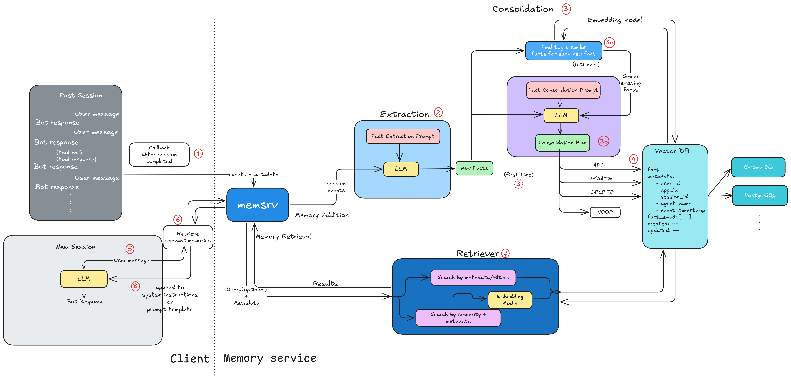

# Memsrv


**Memsrv** is a lightweight, self-hosted memory service for LLMs and agent frameworks. It helps your Agentic or LLM applications **remember facts across sessions**, retrieve information with **semantic search**, and plug into your existing agents with minimal setup. Think of it as a **memory layer** that makes your models more context-aware, consistent and personalized over time.

## Table of Contents
- [Overview](#overview)
- [Why Memsrv?](#why-memsrv)
- [High-Level Architecture and Flow](#high-level-architecture-and-flow)
- [Getting Started](#getting-started)
  - [Prerequisites](#prerequisites)
  - [Installation](#installation)
  - [Running the Server](#running-the-server)
- [Core Functionality](#core-functionality)
- [API Reference](#api-reference)
- [Configuration](#configuration)
- [Using the Service in Your Agent](#using-the-service-in-your-agent)
- [Telemetry and Tracing](#telemetry-and-tracing)
- [Directory Structure](#directory-structure)

## Overview

`Memsrv` is built to give LLMs and agent frameworks a reliable way to manage long-term memory. Instead of relying on session context alone, it provides a structured service for:
* **Fact Extraction** - distilling key information from conversations into structured "memories".
* **Vector based Storage** - encoding facts as embeddings for semantic search.
* **Metadata Filtering** - retrieving memories tied to a specific user, session, or application.

The service is:
* **Modular** - supports multiple vector database backends (e.g., ChromaDB, Postgres with pgvector).
* **Extensible** - works with different LLM and embedding providers.
* **Integrable** - exposes a REST API so memories can be queried or updated from any application, or wrapped directly as tools within your agents.

This design is inspired by [VertexAI Memory Bank](https://cloud.google.com/vertex-ai/generative-ai/docs/agent-engine/memory-bank/overview), but implemented in a lightweight, self-hosted way for developers who want full control over their agent’s memory layer.

> Note: This project is still in active development. For status, milestones and next steps of this project refer [Project Milestones](docs/Milestones.md#project-milestones).

## Why Memsrv?

Most LLM frameworks forget previous context after each session. **Memsrv** adds a persistent, queryable memory layer that allows your AI agents to "recall" information and behave more consistently over time, without relying on proprietary hosted memory solutions. This project aims to provide a fully configurable boilerplate supporting various backend components, allowing developers to build and enhance as they need.

## High level architecture and Flow


## Getting Started

### Prerequisites

*   Python 3.12+
*   uv for dependency management ([uv docs](https://pypi.org/project/uv/))
*   LLM Provider API key for generating content and embeddings.
    - Gemini has a pretty generous limits on their free tier.

### Installation

1.  Clone the repository:

    ```bash
    git clone https://github.com/Ruthvik-1411/memsrv.git
    cd memsrv
    ```

2.  Install dependencies using uv:

    ```bash
    # If you don't have uv installed
    pip install uv

    # Create a venv using uv
    uv venv

    # Activate your venv
    source .venv/bin/activate or .venv\Scripts\activate

    # Install the packages
    uv sync
    ```

3.  Set up your environment variables:

    * Create a copy of the file [`src/env.example`](src/env.example) and rename it to `.env`.
    * Refer [Configuration](#configuration) section for more info on how each variable is used and expected values.

### Running the Server

To start the API server, use the following command:
```bash
cd src

python server.py
# or
uv run server.py
```
This will start the server at `http://localhost:8090`.

## Core Functionality

The `memsrv` service exposes the following core functionalities through its API:

* **Generating Memories**: Extracts facts/memories from conversations and stores them in the database, along with metadata and vector embeddings.
* **Creating Memories**: Directly adds facts/memories and stores them in the database.
* **Retrieving Memories by Metadata**: Retrieves memories based on metadata filters such as user ID, session ID, and application ID.
* **Retrieving Memories by Semantic Similarity**: Retrieves memories that are semantically similar to a given query, optionally filtered by metadata.
* **Updating Memories**: Updates existing memories with new content and/or metadata.
* **Deleting Memories**: Deletes memories from the database by their IDs.

## API Reference

|Endpoint|Method|Description|
|-|-|-|
|`/api/v1/memories/generate`|`POST`|Extracts and stores memories from conversation text|
|`/api/v1/memories/create`|`POST`|Manually create and store a memory. Auto Consolidation.|
|`/api/v1/memories`|`GET`|Retrieve memories filtered by metadata|
|`/api/v1/memories/similar`|`GET`|Retrieve semantically similar memories to a query|
|`/api/v1/memories/update`|`PUT`|Update the text of an existing memory|
|`/api/v1/memories/delete`|`DELETE`|Deletes memories by ID|

The API documentation, request and response schema will be available at `http://localhost:8090/api/v1/docs` after the server is running. You can use this Swagger UI to explore the available endpoints and test them out.

## Configuration

The service's behavior is configured through environment variables and the [`src/config.py`](src/config.py) file. Refer the [`src/env.example`](src/env.example) for the complete list of expected values.

<details>
    <summary>Config values and defaults</summary>

|Variable|Description|Required|Default|
|-|-|-|-|
|`LLM_PROVIDER`|The LLM provider to use for fact extraction.|✅|`gemini`|
| `LLM_MODEL` | Model name for the chosen LLM provider. | ✅ | `gemini-2.0-flash` |
| `GOOGLE_API_KEY` | API key for accessing Google Gemini LLM and embeddings. | ✅ | - |
| `EMBEDDING_PROVIDER` | Provider for generating vector embeddings. | ✅ | `gemini` |
| `EMBEDDING_MODEL` | Embedding model to use. | ✅ | `gemini-embedding-001` |
| `EMBEDDING_DIM` | Dimensionality of the embedding vectors. | ❌ | `768` |
| `DB_PROVIDER` | Database backend for storing vectors. Options: `chroma_lite`, `chroma`, `postgres`. | ✅ | `chroma_lite` |
| `DB_COLLECTION_NAME` | Collection name for storing memory entries. | ✅ | `memories` |
| `DB_DESCRIPTION` | Optional description of the collection. | ❌ | `"Collection for memories"` |
| `DB_PERSIST_DIR` | Path to local directory for Chroma Lite persistence. | ❌ | `./chroma_db` |
| `DB_HOST` | Host for Chroma (HTTP) or other self hosted Vector DB. | ❌ | `localhost` |
| `DB_PORT` | Port for Chroma (HTTP) or other self hosted Vector DB. | ❌ | `8000` (Chroma) |
| `DATABASE_USER` | Username for Postgres. | ✅ (if Postgres) | - |
| `DATABASE_PASSWORD` | Password for Postgres. | ✅ (if Postgres) | - |
| `DATABASE_NAME` | Database name for Postgres. | ✅ (if Postgres) | - |
| `DATABASE_HOST` | Host for Postgres. | ❌ | `127.0.0.1` |
| `DATABASE_PORT` | Port for Postgres. | ❌ | `5432` |
| `DB_PROVIDER_CONFIG` | Additional backend-specific configuration (e.g., Chroma index parameters). | ❌ | `{"hnsw": {"space": "cosine"}}` |
| `ENABLE_OTEL` | Enable or disable OpenTelemetry tracing. | ❌ | `false` |
| `OTEL_SERVICE_NAME` | Service name for telemetry traces. | ❌ | `memsrv` |
| `OTEL_EXPORTER_OTLP_ENDPOINT` | Endpoint for sending trace data. | ❌ | `http://localhost:6006/v1/traces` |
| `OTEL_EXPORTER_OTLP_HEADERS` | Additional headers for the OTLP exporter. | ❌ | - |
</details>

## Using the service in your agent

> The package installations for running examples is seperated from the core service dependencies. See [Installing dependencies for examples](docs/Setup.md#example-dependencies) to install the packages for the examples you want to run.

### Google ADK
See [examples/agents/adk/README.md](examples/agents/adk/README.md) for details on how to use `google-adk` with memory injection and the `PreloadMemoryTool`.

### LangChain / LangGraph
See [examples/agents/langchain/README.md](examples/agents/langchain/README.md) for details on integrating memory into agents built with LangChain or LangGraph, including both the **Callable Prompt** and **Agent Middleware** approaches.

## Telemetry and Tracing

Memsrv comes with built-in **OpenTelemetry (OTEL)** support for end-to-end tracing.

When enabled, every key operation from **LLM calls**, **fact extraction**, **fact consolidation** and **memory storage** to **API requests** is automatically traced.  
These traces can be exported to **any OTLP-compatible collector**, such as **Phoenix**, **Jeager**, **Grafana Tempo**, or **Honeycomb**.

Enable it by setting:

```bash
ENABLE_OTEL=true
OTEL_EXPORTER_OTLP_ENDPOINT=http://trace-collector-endpoint
```
To learn more about how tracing works and how to configure it, see [Telemetry and Tracing Guide](docs/Telemetry.md)

Find some images of traces captured for `memsrv` here - [Memsrv Traces](docs/Telemetry.md#example-trace-outputs-for-memsrv).

## Directory Structure

```
└── memsrv/
    ├── README.md                       # This file
    └── src/
        ├── config.py                   # Configuration file for selecting LLMs and vector DBs and respective config vars
        ├── server.py                   # Entry point for running the FastAPI server
        └── memsrv/
            ├── api/
            │   ├── main.py             # FastAPI application entry point
            │   └── routes/
            │       └── memory.py       # API routes for memory management
            ├── core/
            │   ├── extractor.py        # Extracts facts from conversations
            │   ├── memory_service.py   # Core logic for memory management
            │   └── prompts.py          # Prompts used for fact extraction
            ├── db/
            │   ├── base_adapter.py     # Abstract base class for database adapters
            │   ├── utils.py            # Utils file for common funcs for db
            │   └── adapters/
            │       ├── __init__.py
            │       ├── chroma_lite.py  # ChromaDBLite adapter (local)
            │       ├── chroma.py       # ChromaDB adapter (client-server)
            │       └── postgres.py     # Postgres adapter
            ├── embeddings/
            │   ├── base_config.py      # Base class for embedding configurations
            │   ├── base_embedder.py    # Abstract base class for embedding providers
            │   └── providers/
            │       └── gemini.py       # Gemini embedding provider
            ├── llms/
            │   ├── __init__.py
            │   ├── base_config.py      # Base class for LLM configurations
            │   ├── base_llm.py         # Abstract base class for LLMs
            │   └── providers/
            │       └── gemini.py       # Gemini LLM provider
            ├── models/
            │   └── memory.py           # Data models for memories
            │   └── requests.py         # Data models for API requests
            │   └── response.py         # Data models for API responses
            ├── telemetry/
            │   └── __init__.py
            │   └── constants.py        # Constant values for span attribute mapping
            │   └── helpers.py          # Helpers functions for tracing specific funcs
            │   └── setup.py            # Sets up tracer provider + exporters
            │   └── tracing.py          # Core logic for tracing, span creation and decorators
            └── utils/
                ├── factory.py          # Factory that constructs the individual services(llm, embd, db)
                └── logger.py           # Common logger for all files

```

## License

This project is licensed under MIT License, see [LICENSE](./LICENSE) file for more info. Feel free to modify and use as needed and build on top of this.
