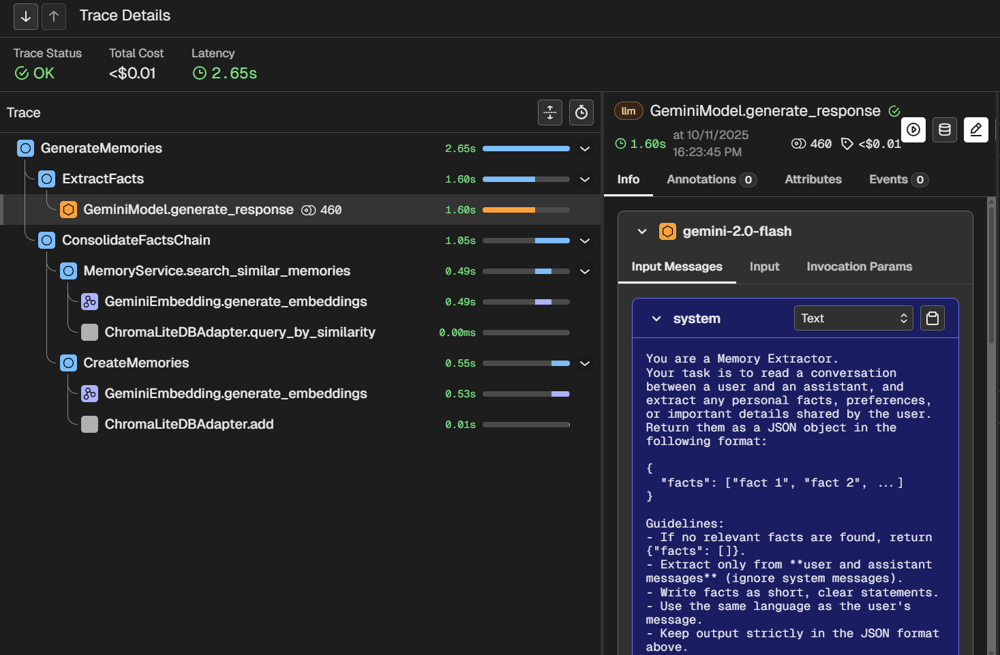
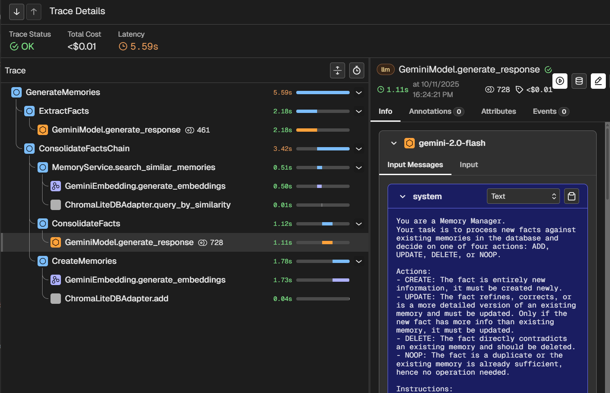
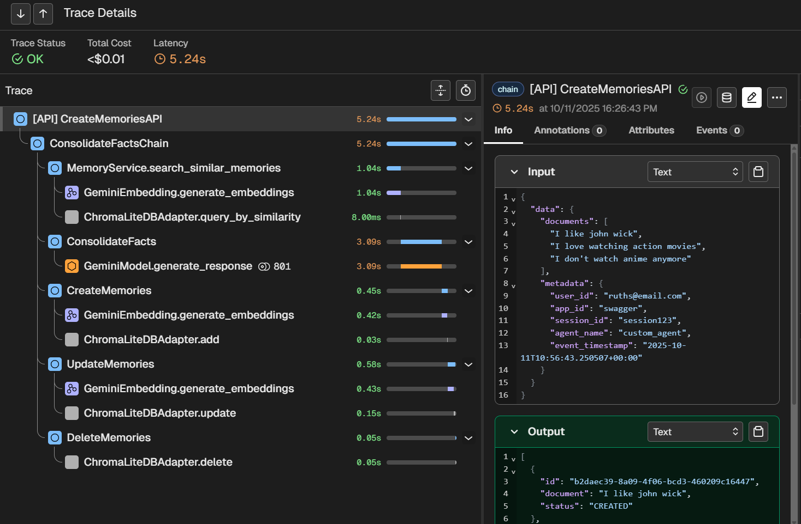
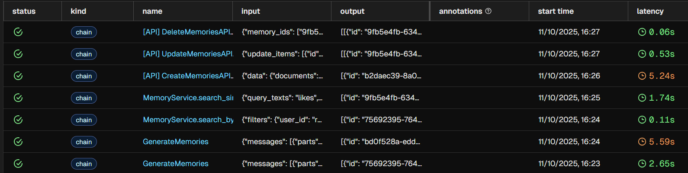

# Telemetry and Tracing in Memsrv

`memsrv` includes built-in **telemetry** powered by **OpenTelemetry (OTEL)** and **OpenInference** conventions. This allows us to trace **LLM calls**, **embedding generation**, **database operations**, and **API requests** end-to-end, helping in visualize, debug, and optimize the agent's memory interactions.

## Overview

Telemetry in `memsrv` is implemented through the `memsrv/telemetry` module, which:

- Initializes an **OpenTelemetry tracer** (with optional OTLP exporter)
- Automatically instruments key memory operations using the `@traced_span` decorator
- Emits structured span attributes following **OpenInference semantic conventions**
- Supports **LLM, Embedding, and DB spans** for unified observability

### Features
- Trace **LLM invocations** (provider, model, messages, tokens)
- Trace **embedding generation** and retrieval
- Trace **database operations** and API endpoints
- Export traces to **any OTLP-compatible collector** (e.g., Phoenix, Jaeger, Grafana Tempo, Honeycomb)
- Works locally (console exporter) and in production (OTLP endpoint)

## Configuration

Telemetry is configured through the following environment variables:

| Variable | Description | Default |
|-----------|--------------|----------|
| `ENABLE_OTEL` | Enable or disable OpenTelemetry tracing. | `false` |
| `OTEL_SERVICE_NAME` | Service name for trace grouping. | `memsrv` |
| `OTEL_EXPORTER_OTLP_ENDPOINT` | Endpoint for sending OTLP traces (e.g., `http://localhost:6006/v1/traces`). | - |
| `OTEL_EXPORTER_OTLP_HEADERS` | Optional headers for OTLP exporter (`key=value,key2=value2`). | - |

> When `ENABLE_OTEL=false`, all telemetry functions are safely disabled. If for some reason, unable to send traces to the collector, errors are supressed and logged for debugging.

## How It Works

Telemetry spans are created using the custom decorator **`@traced_span`**, defined in  [`memsrv/telemetry/tracing.py`](../src/memsrv/telemetry/tracing.py#L27).

Example usage:
```python
from memsrv.telemetry.helpers import traced_span
from memsrv.telemetry.constants import CustomSpanKinds, CustomSpanNames

@traced_span(name=CustomSpanNames.CREATE_MEMORIES, kind=CustomSpanKinds.CHAIN)
async def create_memories(self, memory_data):
    # The actual logic
    ...
```

> All span names and kinds are defined in [memsrv/telemetry/constants.py](../src/memsrv/telemetry/constants.py)

### What Happens Under the Hood?

The decorator starts a new OTEL span when the function is called. It automatically attaches:
- Common attributes (service.name, version, environment)
- Input/output payloads (safely serialized)
- Error status if exceptions occur

LLM and embedding calls use helper functions:
- `trace_llm_call()` adds model/provider, input, output messages and token usage metadata.
- `trace_embedder_call()` marks embedding spans.

## Example trace outputs for memsrv

Below are some real trace examples captured for `memsrv` using OpenTelemetry and an OTLP-compatible collector(Phoenix).

<div align="center">

<table>
<tr>
<td align="center">
<b>First-Time Memory Generation Trace</b><br>

</td>
<td align="center">
<b>Memory Generation with Consolidation Trace</b><br>

</td>
</tr>
<tr>
<td align="center">
<b> API <code>Create Memory</code> Request Trace</b></b><br>

</td>
<td align="center">
<b>Overview: Trace Collector Dashboard (All Operations)</b><br>

</td>
</tr>
</table>

</div>

> You can open these traces in your preferred collector (Phoenix, Jaeger, Grafana Tempo) to explore timing, nested spans, and attributes in real time. Just enable the required variables in the .env file and run the server.

## Development

To quickly enable local tracing, set:
```bash
ENABLE_OTEL=true
# your collector endpoint should be added below, 6006 is for Phoenix
OTEL_EXPORTER_OTLP_ENDPOINT=http://localhost:6006/v1/traces
```
Then run your server, the spans will print to the console and sent to the configured endpoint as well.

- When deploying, disable the console exporter in [setup_tracer()](../src/memsrv/telemetry/setup.py#L29) and use an external OTLP collector.

You can manually create child spans using `start_child_span` within the functions as well:
```python
from memsrv.telemetry.helpers import start_child_span

with start_child_span("memsrv.deduplication", step="fact_deduplication") as span:
    # your logic
    ...
```

## References that were helpful

- [OpenTelemetry Python Docs](https://opentelemetry.io/docs/languages/python/)
- [OpenInference Semantic Conventions](https://github.com/Arize-ai/openinference)
- [OTLP Protocol Specification](https://opentelemetry.io/docs/specs/otlp/)
- [LLM calls examples](https://opentelemetry.io/docs/specs/semconv/gen-ai/non-normative/examples-llm-calls/)
- [LLM call attributes](https://github.com/Arize-ai/openinference/blob/main/python/openinference-instrumentation/src/openinference/instrumentation/_attributes.py)
